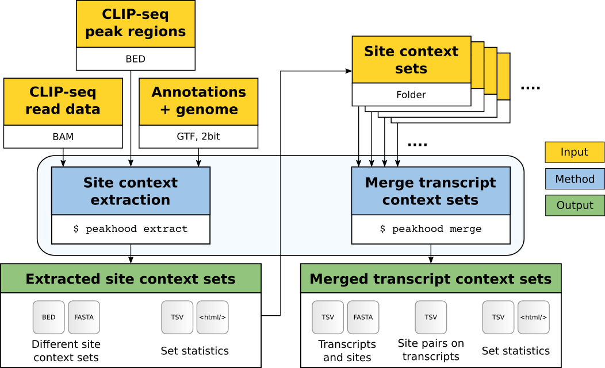

# Peakhood

[](https://github.com/BackofenLab/Peakhood)
[](https://anaconda.org/bioconda/peakhood)

Peakhood is a tool that takes a set of CLIP-seq peak regions, and for each region individually extracts 
the most likely site context (transcript or genomic).
In the following, we quickly explain [how Peakhood works](#introduction), 
followed by an [installation guide](#installation), some [example runs](#example-runs) to demonstrate its usefulness, 
and last but not least a comprehensive [documentation](#documentation) of all Peakhood features.


## Table of contents

- [Introduction](#introduction)
- [Installation](#installation)
    - [Conda](#conda)
    - [Conda package installation](#conda-package-installation)
    - [Manual installation](#manual-installation)
- [Example runs](#example-runs)
    - [Getting input data for context extraction](#getting-input-data-for-context-extraction)
    - [Site context extraction](#site-context-extraction)
    - [Merging transcript context sets](#merging-transcript-context-sets)
    - [Batch processing many datasets](#batch-processing-many-datasets)
- [Documentation](#documentation)
    - [Program modes](#program-modes)
    - [Site context selection](#site-context-selection)
    - [Choosing the most likely transcript](#choosing-the-most-likely-transcript)
    - [Inputs](#inputs)
    - [Outputs](#outputs)
    - [Visual exploration](#visual-exploration)


## Introduction

Peakhood takes genomic CLIP-seq peak regions, and determines the most likely site context for each of these regions (full details [here](#site-context-selection)). The site context (i.e., the sequence context around the peak region) can either be genomic (introns contained), or transcript (introns removed, spliced RNA). While the genomic context is arguably correct for intronic or intergenic sites, exonic sites (regions overlapping with exons) can fall into either one of the two context categories. Peakhood makes this decision based on the given gene annotations (GTF file containing exon regions) and the given read information from the CLIP-seq experiment (BAM format).

Peakhood makes use of the observation that RBP binding within a spliced transcript context goes along with high exon-intron read coverage ratios in the respective genomic region. In other words, we can see many mapped reads from exon regions harboring binding sites, while the surrounding intron regions should show a substantial drop in coverage. Moreover, we can observe intron-spanning reads connecting neigboring exons, further supporting a spliced (== transcript) context. The following [IGV](https://software.broadinstitute.org/software/igv/) genomic region snapshot illustrates this:


**Fig. 1**: Genomic region (NACA gene) with mapped PUM2 eCLIP data (K562 cell line, replicates merged, only R2 reads shown). 1: read profile (coverage range in brackets), 2: read alignments, 3: gene annotations (thick blue regions are exons, thin blue regions introns), Peaks: peaks called by CLIPper (IDR method). Example region for the predominantly spliced RNA binding RBP PUM2, with exon border sites connected by intron-spanning reads.

Fig. 1 depicts a typical example for exonic sites in a transcript context, with the observed transcript context properties: substantial coverage drops at exon borders, reads predominantely mapping to exonic regions, large numbers of intron-spanning reads to connect exon borders. In this example the two sites also clearly form one single binding region. It would thus be wrong to interpret them as separate binding events. Peakhood takes care of this issue as well, by merging exon border sites connected by intron-spanning reads (more details [here](#exon-border-sites)). In contrast, the following example shows an exonic site in a genomic context:


**Fig. 2**: Genomic region (EIF4G2 gene) with mapped U2AF2 eCLIP data (K562 cell line, replicates merged, only R2 reads shown). 1: read profile (coverage range in brackets), 2: read alignments, 3: gene annotations (thick blue regions are exons, thin blue regions introns), Peaks: peaks called by CLIPper (IDR method). Example region for the splicing factor U2AF2, with higher read counts over exon borders and introns.

Here we can see an exonic site in a genomic context, with some typical genomic context properties: a substantial amount of reads overlapping the exon border, or mapping to neighboring intronic regions.

Depending on the library depth or local read coverage, there are of course also cases where the evidence is less clear, making it harder to decide which context is more authentic. 
Furthermore, since splicing is a sequential operation and the read evidence is collected for many different cells, we can have cases where we see many intron-spanning reads along with substantial intronic coverage. This would make sense if the RBP (or the complex it is part of) binds in a co-transcriptional setting, and remains bound some time after splicing. 
Moreover, there are RBPs with distinct roles in the cytoplasm and the nucleus, and thus can bind to both contexts. Here we would expect larger fractions of exonic sites assigned to both contexts (see [here](#default-thresholds) for further discussion). In any case, selecting the site context should be done individually for each site, as done by Peakhood. For Peakhood results on some typical transcript and genomic context binders (PUM1, U2AF2), see the following [Example runs](#example-runs) section.

Besides [site context selection](#site-context-selection), Peakhood also chooses the most likely transcript for each exonic site assigned to transcript context (full details [here](#choosing-the-most-likely-transcript)). This is necessary since there are usually several compatible site-transcript combinations available from the GTF file. Reference and custom GTF files are supported, and we recommend to use a custom GTF file if cell type or condition-specific RNA-seq data is available (how to generate one [here](#custom-gtf-files)).

After site context extraction, transcript context datasets can be merged into transcript context site collections. The following figure shows how the two program modes `peakhood extract` and `peakhood merge` are connected:



**Fig. 3**: Overview of the Peakhood workflow for the two main program modes extract and merge. Yellow boxes mark necessary inputs, blue boxes the two main program modes, and green boxes the outputs. Arrows show the dependencies between inputs, modes, and outputs.

Peakhood also supports batch processing (`peakhood batch`, example run [here](#batch-processing-many-datasets)), i.e., to run site context extraction for any number of input sets and merge the extracted transcript context sets in one single run. 
Further details on Peakhood's program modes, as well as its inputs and ouputs can be found in the [documentation](#documentation).


## Installation

Peakhood requires Linux and was tested on Ubuntu (18.04 LTS). In the following we show how to install Peakhood via Conda package (easiest way + recommended), or alternatively manually (not too difficult either). In any case, you first need Conda running on your computer.

### Conda

If you do not have Conda yet, you can e.g. install miniconda, a free + lightweight Conda installer. Get miniconda [here](https://docs.conda.io/en/latest/miniconda.html), choose the Python 3.8 Miniconda3 Linux 64-bit installer and follow the installation instructions. In the end, Conda should be evocable on the command line via (possibly in a more advanced version):

```
$ conda --version
conda 4.10.1
```


### Conda package installation

Peakhood is available as a Conda package [here](https://anaconda.org/bioconda/peakhood). This is the most convenient way to install Peakhood, since Conda takes care of all the dependencies. Note however that the Conda package version might not always be the latest release (but we work hard to not let this happen).

We recommend to create a Conda environment inside which we will then install Peakhood:

```
conda create -n peakhood python=3.8 -c conda-forge -c bioconda
conda activate peakhood
conda install -c bioconda peakhood
```

If you are experiencing problems while running `conda install -c bioconda peakhood` (e.g. complaints about conflicting dependencies), the following commands should do the trick:

```
conda config --add channels bioconda
conda config --add channels conda-forge
```

This tells conda to explicitly look for packages in the specified channels, stored in the `.condarc` [conda configuration file](https://conda.io/projects/conda/en/latest/user-guide/configuration/use-condarc.html).


Now Peakhood should be available inside the environment:


```
peakhood -h
```


### Manual installation

To manually install Peakhood, we first create a Conda environment (as described [above](#conda)). Once inside the environment, we need to install the following dependencies:


```
conda install -c conda-forge seaborn
conda install -c conda-forge markdown
conda install -c bioconda bedtools
conda install -c bioconda samtools
conda install -c bioconda ucsc-twobitinfo
conda install -c bioconda ucsc-twobittofa
```

Peakhood was tested with the following versions: bedtools (2.30.0), samtools (1.13), markdown (3.3.4), seaborn (0.11.1). Finally, to install the tool itself, we simply clone the repository and execute the installation script inside the folder:

```
git clone https://github.com/BackofenLab/Peakhood.git
cd Peakhood
python -m pip install . --ignore-installed --no-deps -vv --use-feature=in-tree-build
```

Now we can run Peakhood from any given folder (just remember to re-activate the environment once you open a new shell):

```
peakhood -h
```


## Example runs

Once installed, we can do some example runs. In the following, we describe how to obtain the input data, and show how the different modes (extract, merge, batch) of Peakhood work.


### Getting input data for context extraction

To extract the site context information of CLIP-seq peak regions, Peakhood needs the following inputs:

- A genomic CLIP-seq peak regions file in BED format (6-column BED)
- One or more BAM files (in case of replicates), containing the mapped CLIP-seq reads on which the peak regions were called
- A genomic annotations file (GTF format) (e.g. for humans from [Ensembl](https://www.ensembl.org/info/data/ftp/index.html), [GENCODE](https://www.gencodegenes.org/human/), or a [custom GTF file](#custom-gtf-files))
- A genomic sequences file (.2bit) matching the GTF file (human hg38 assembly `hg38.2bit` file [here](https://hgdownload.cse.ucsc.edu/goldenpath/hg38/bigZips/))

In this example, we use one of the many eCLIP datasets (BED peak regions + BAM files) available on [ENCODE](https://www.encodeproject.org/), namely eCLIP data for the RNA-binding protein PUM1, conducted in the cell line K562 ([experiment link](https://www.encodeproject.org/experiments/ENCSR308YNT/)). We first download and convert the IDR peak regions file:

```
wget https://www.encodeproject.org/files/ENCFF094MQV/@@download/ENCFF094MQV.bed.gz
gunzip -c ENCFF094MQV.bed.gz | awk '{print $1"\t"$2"\t"$3"\t"$4"\t"$7"\t"$6}' > PUM1_K562_IDR_peaks.bed
bed_generate_unique_ids.py  --in PUM1_K562_IDR_peaks.bed --id PUM1_K562_IDR > PUM1_K562_IDR_peaks.uniq_ids.bed
```

This downloads and converts the IDR peaks file to 6-column BED format (log2 fold change stored in column 5). Note the Python script `bed_generate_unique_ids.py` that was installed along with `peakhood`. In addition, we generate unique column 4 IDs, which are needed for Peakhood (can also be done with the `peakhood extract` option `--new-site-id PUM1_K562_IDR`). Next we download the BAM files (for ENCODE eCLIP data there are two replicates available):

```
wget -O PUM1_K562_rep1.bam https://www.encodeproject.org/files/ENCFF064COB/@@download/ENCFF064COB.bam
wget -O PUM1_K562_rep2.bam https://www.encodeproject.org/files/ENCFF583QFB/@@download/ENCFF583QFB.bam
```

Peakhood allows the input of more than one BAM file, which will be merged by Peakhood internally. We encourage to use all available read information from the CLIP-seq experiment (i.e., merging of replicates), as Peakhood relies on the read information to determine which context (genomic or transcript) applies to each given CLIP-seq peak region, and in case of a transcript context also the most likely transcript. In the eCLIP protocol, the second read of the pair (R2) is the informative read, so we need to set `--bam-pp-mode 2`, while e.g. for iCLIP, we need to take the R1 reads (`--bam-pp-mode 3`). The preprocessing can also be done manually before feeding the data into Peakhood (saves time in case of running Peakhood many times), see the [BAM files](#bam-files) section on how to do this.

Finally, we need to download a GTF file (containing genomic annotations) and a .2bit file (containing the genomic sequences):

```
wget https://hgdownload.cse.ucsc.edu/goldenpath/hg38/bigZips/hg38.2bit
wget http://ftp.ensembl.org/pub/release-103/gtf/homo_sapiens/Homo_sapiens.GRCh38.103.gtf.gz
```

To get the most recent GTF file, check the [Ensembl FTP download page](https://www.ensembl.org/info/data/ftp/index.html) (for GENCODE see [here](https://www.gencodegenes.org/human/)). Unfortunately, we sometimes experienced cases where the GTF file was not fully downloaded. You can check this by browsing the file with:

```
less Homo_sapiens.GRCh38.103.gtf.gz
```

We would expect something like this appearing as first rows:

```
#!genome-build GRCh38.p13
#!genome-version GRCh38
#!genome-date 2013-12
#!genome-build-accession NCBI:GCA_000001405.28
#!genebuild-last-updated 2020-08
```

If the output is cryptic instead, you need to do it again. We tested Peakhood with GENCODE and Ensembl GTF files, as well as custom GTF files. For this example run, we will use a GTF file from Ensembl, but we definitely recommend creating a custom GTF file, if there is cell-type specific RNA-seq data at hand (see motivation and instructions [below](#custom-gtf-files) on how to do this).


### Site context extraction

Now that we have all the input data at hand, we can extract the likely site context for each CLIP-seq peak region with `peakhood extract`:


```
peakhood extract --in PUM1_K562_IDR_peaks.uniq_ids.bed --bam PUM1_K562_rep1.bam PUM1_K562_rep2.bam --bam-pp-mode 2 --gtf Homo_sapiens.GRCh38.103.gtf.gz --gen hg38.2bit --report --out PUM1_K562_IDR_extract_out
```

This will output the input sites and their different contexts in separate files (BED regions + FASTA sequences files). These context or region types are: exonic sites (assigned to transcript context), exonic sites (assigned to genomic context), intronic sites, and intergenic sites. A site is exonic if it overlaps an exonic region (annotations from GTF file) by a certain minimum amount (default >= 90%, controlled by `--min-exon-overlap`). Depending on the read distribution around the overlapping exon(s), and on the remaining exons of the corresponding transcript(s), the site then gets assigned to transcript context (i.e., spliced context, introns removed) or genomic context (introns included, plain genomic sequence). Sites with exon overlap < `--min-exon-overlap` become intronic sites, or, if they do not overlap with any transcripts from the GTF file, intergenic sites. 

Since eCLIP IDR peaks often contain peak regions located adjacent to each other (book-ended), it makes sense to merge these regions before running the context extraction. Since site IDs of merged sites get concatenated, it also makes sense to create new IDs to prevent very long IDs (the new site IDs are created after pre-merging). For this we add `--pre-merge` and `--new-site-id`:

```
peakhood extract --in PUM1_K562_IDR_peaks.uniq_ids.bed --bam PUM1_K562_rep1.bam PUM1_K562_rep2.bam --bam-pp-mode 2 --gtf Homo_sapiens.GRCh38.103.gtf.gz --gen hg38.2bit --report --out PUM1_K562_IDR_pm_extract_out --pre-merge --new-site-id PUM1_K562_IDR
```

In our case the output will look like this (only the last bits):

```
...

Percentage (# exonic sites / # all input sites):
94.55 %
Percentage (# transcript context sites / # exonic sites):
95.71 %
Percentage (# exon border sites / # transcript context sites):
24.72 %

Generate HTML report ... 

OUTPUT FILES
============

Context extraction statistics report HTML:
PUM1_K562_IDR_pm_extract_out/report.peakhood_extract.html
All sites + assigned region type information TSV:
PUM1_K562_IDR_pm_extract_out/all_sites.tsv

EXONIC SITES ASSIGNED TO TRANSCRIPT CONTEXT:

All transcript context site-transcript combinations BED:
PUM1_K562_IDR_pm_extract_out/exonic_sites.tr_con.all_tr.bed
All transcript context site-transcript combinations FASTA:
PUM1_K562_IDR_pm_extract_out/exonic_sites.tr_con.all_tr.fa
Selected transcript context site-transcript combinations BED:
PUM1_K562_IDR_pm_extract_out/exonic_sites.tr_con.sel_tr.bed
Selected transcript context site-transcript combinations FASTA:
PUM1_K562_IDR_pm_extract_out/exonic_sites.tr_con.sel_tr.fa
Assigned transcript context site statistics TSV:
PUM1_K562_IDR_pm_extract_out/transcript_context_site_stats.tsv
Associated full transcript sequences FASTA:
PUM1_K562_IDR_pm_extract_out/transcript_sequences.fa
Transcript context sites on genome BED:
PUM1_K562_IDR_pm_extract_out/exonic_sites.tr_con.gen.bed
Transcript context sites on genome FASTA:
PUM1_K562_IDR_pm_extract_out/exonic_sites.tr_con.gen.fa

EXONIC SITES ASSIGNED TO GENOMIC CONTEXT:

Exonic sites assigned to genomic context BED:
PUM1_K562_IDR_pm_extract_out/exonic_sites.gen_con.bed
Exonic sites assigned to genomic context FASTA:
PUM1_K562_IDR_pm_extract_out/exonic_sites.gen_con.fa

INTRONIC SITES:

Intronic sites BED:
PUM1_K562_IDR_pm_extract_out/intronic_sites.bed
Intronic sites FASTA:
PUM1_K562_IDR_pm_extract_out/intronic_sites.fa

INTERGENIC SITES:

Intergenic sites BED:
PUM1_K562_IDR_pm_extract_out/intergenic_sites.bed
Intergenic sites FASTA:
PUM1_K562_IDR_pm_extract_out/intergenic_sites.fa
```

Here we can see all the important output files listed, which also includes an HTML report, containing assigned region type as well as additional statistics and plots (see [Outputs](#outputs) section for details on file contents). We can also see some important percentage values given, namely the percentages of # exonic sites divided by # all input sites, # transcript context sites divided by # exonic sites, and # exon border sites divided # transcript context sites.
The first one tells us how many of the input sites overlap with exon regions, the second one how much of the exonic sites have been assigned to transcript context, and the third one how many of the transcript context sites are located at exon borders and connected by intron-spanning reads (and thus got merged to single sites by Peakhood). For RBPs binding predominantly to spliced RNA (transcript context), we expect high percentages for the first two. Indeed, we get around 95% for both, in agreement with PUM1's known roles in post-transcriptional gene regulation. Interestingly, we also get about 25% of sites called at adjacent exon borders, connected by intron-spanning reads. This again showcases the importance of a proper [site context selection](#site-context-selection), as done by Peakhood. If we would just take the genomic regions from the input BED regions file, we would falsely interpret these peaks as separate binding events. As a comparison, running Peakhoood on the pre-mRNA binding splicing factor U2AF2 ([experiment link](https://www.encodeproject.org/experiments/ENCSR893RAV/)) yields 17.14% exonic sites (# exonic sites divided by # all input sites), but out of these only 6.10% (34 out of a total 3,250 sites, `--pre-merge` set) are assigned to transcript context (# transcript context sites divided by # exonic sites) (and of these 11.76% being exon border sites connected by intron-spanning reads).


Regarding the transcript context files, there are two categories: the `all_tr` and the `sel_tr` files. The first group contains all possible site-transcript combinations, i.e., for each site all compatible transcripts. The latter one includes only one (selected) site-transcript combination per site, with the transcript being the most likely one associated with the site (selected based on a series of filtering operations, more details [here](#choosing-the-most-likely-transcript)).
For this example we used Peakhood's default parameters.
Note however that there are many more options for `peakhood extract` (see [Documentation](#documentation)), e.g. the possibility to [include RNA-seq data](#including-rna-seq-data-in-context-extraction), to change filter settings, or to extend the sites to include more sequence context.


### Merging transcript context sets

After we ran `peakhood extract` for a number of CLIP-seq datasets, we can use `peakhood merge` to merge all extracted transcript context sets. Assume we ran `peakhood extract` for [PUM1 K562](https://www.encodeproject.org/experiments/ENCSR308YNT/), [PUM2 K562](https://www.encodeproject.org/experiments/ENCSR661ICQ/), and [IGF2BP1 K562](https://www.encodeproject.org/experiments/ENCSR975KIR/), we can merge the datasets by:


```
peakhood merge --in PUM1_K562_IDR_pm_extract_out PUM2_K562_IDR_pm_extract_out IGF2BP1_K562_IDR_pm_extract_out --out test_merge_out --report
```

Again we set `--report` to generate an HTML report, containing various statistics and plots for all input datasets (comparing site lengths, region types, percentages). The output looks the following (again only the last bits):


```
...

# of all transcripts with sites:          12377
# of selected transcripts with sites:     4282
# of site pairs on all transcripts:         54856
# of site pairs (from different datasets):  20541
# of site pairs on selected transcripts:    18769
# of site pairs (from different datasets):  6978
Generate HTML report ... 

OUTPUT FILES
============

Merged dataset statistics report HTML:
test_merge_out/report.peakhood_merge.html
Exonic site stats for each dataset TSV:
test_merge_out/exonic_site_set_stats.tsv
All transcript regions BED:
test_merge_out/all_transcript_regions.bed
All transcript sequences FASTA:
test_merge_out/all_transcript_sequences.fa
All transcripts with sites TSV:
test_merge_out/transcripts_with_sites.all_tr.tsv
Selected transcripts with sites TSV:
test_merge_out/transcripts_with_sites.sel_tr.tsv
Site pairs on all transcripts TSV:
test_merge_out/sites_on_same_transcripts.all_tr.tsv
Site pairs on selected transcripts TSV:
test_merge_out/sites_on_same_transcripts.sel_tr.tsv
```

Again we can see output files for all site-transcript combinations, as well as only the selected site-transcript combinations. The `transcripts_with_sites` files list all the transcripts and the sites located on them, together with transcript and gene annotations (transcript biotype, gene name etc.). The `sites_on_same_transcripts` list all site pairs on same transcripts, including sites from the same dataset, but also from different datasets. In addition, it includes transcript and original genomic distances for each site pair, together with differences between the two distances. This way, one can quickly check e.g. which sites from different datasets (different RBPs) decreased in distance compared to their genomic distance from the input region files. Two sites might actually be located in close proximity on the same transcript, but the original genomic distance did not indicate this, since there might have been an intron separating the two sites.

As described, the transcript context files also contain sites merged because they are located at adjacent exon borders and are connected via intron-spanning reads (see [exon border sites](#exon-border-sites) section for more details). These IDs get a new ID, with the format `id1-EB-id2`. Also, if `--pre-merge` was set in `peakhood extract`, but not `--new-site-id`, pre-merged sites get IDs like `ìd1,id2,id3`. Additional output files include all transcript sequences from the single extraction runs (FASTA format), as well as their genomic regions in 12-column BED format (this include exon annotations, for displaying e.g. inside IGV).


### Batch processing many datasets

Peakhood also supports batch processing. All we need to do is to store the input BED and BAM files in a specific folder inside the input folder for `peakhood batch`. The format should be as follows: `dataset_id.bed` and `dataset_id.bam` (or for single replicates: `dataset_id_rep1.bam`, `dataset_id_rep2.bam`). Taking our input example, the content of a valid `peakhood batch` input folder could thus look like:

```
$ ls | sort
IGF2BP1_K562_IDR.bed
IGF2BP1_K562_IDR_rep1.bam
IGF2BP1_K562_IDR_rep2.bam
PUM1_K562_IDR.bed
PUM1_K562_IDR_rep1.bam
PUM1_K562_IDR_rep2.bam
PUM2_K562_IDR.bed
PUM2_K562_IDR_rep1.bam
PUM2_K562_IDR_rep2.bam
```

Then all we have to do to process all the files is to run:


```
peakhood batch --in batch_test_in --gtf Homo_sapiens.GRCh38.103.gtf.gz --gen hg38.2bit --out batch_test_out --bam-pp-mode 2 --report
```

This includes running `peakhood extract` on all single datasets, and afterwards `peakhood merge` on the generated datasets. Regarding site extraction options, `peakhood batch` accepts (almost) all `peakhood extract` options (such as `--pre-merge`, or filtering options), i.e., to process all input datasets the same way. Setting `--report` equals to setting `--report` for each extraction run, as well as the merge part. Output files correspond to the `peakhood merge` output files, and the single `peakhood extract` output folders are stored inside `batch_test_out`.

NOTE that if the BAM files have already been merged and filtered by R1 or R2 reads, `--bam-pp-mode 2` should not be set. Moreover, if the BED files do not contain unique IDs, `peakhood batch` can generate them for each set by adding `--new-ids` to the command. Likewise, if you have eCLIP IDR peaks, you might want to do pre-merging of the peak regions (i.e., merging book-ended and overlapping regions). The new batch command then looks like:

```
peakhood batch --in batch_test_in --gtf Homo_sapiens.GRCh38.103.gtf.gz --gen hg38.2bit --out batch_test_out --report --new-ids --pre-merge
```


## Documentation


This documentation provides further details on Peakhood (version 0.1), divided into the following sections:
the different [program modes](#program-modes) of Peakhood, how [site context selection](#site-context-selection) works, how Peakhood [chooses the most likely transcript](#choosing-the-most-likely-transcript), Peakhood's [Inputs](#inputs), Peakhood's [Outputs](#outputs), and last but not least how [visually explore](#visual-exploration) the output data.


### Program modes

Peakhood is divided into four different program modes: site context extraction (`peakhood extract`), merging extracted datasets (`peakhood merge`), batch process (extract and merge) multiple datasets (`peakhood batch`), and motif search inside the different context sets (`peakhood motif`).


An overview of the modes can be obtained by:


```
$ peakhood -h
usage: peakhood [-h] [-v] {extract,merge,batch,motif} ...

Individual site context extraction for CLIP-Seq peak regions.

positional arguments:
  {extract,merge,batch,motif}
                        Program modes
    extract             Site context extraction
    merge               Merge extracted transcript context sets
    batch               Batch processing (extract + merge)
    motif               Search for motif in context sets

optional arguments:
  -h, --help            show this help message and exit
  -v, --version         show program's version number and exit

```

The following subsections describe each mode in more detail.


#### Site context extraction

The following command line arguments are available in `peakhood extract` mode:


```
$ peakhood extract -h
usage: peakhood extract [-h] --in str --bam str [str ...] --gtf str --gen str
                        --out OUT_FOLDER
                        [--site-id LIST_SITE_IDS [LIST_SITE_IDS ...]]
                        [--thr float] [--thr-rev-filter] [--max-len int]
                        [--min-exon-overlap float] [--min-ei-ratio float]
                        [--min-eib-ratio float] [--eib-width int]
                        [--eibr-mode {1,2}] [--no-eibr-filter]
                        [--no-eir-wt-filter] [--no-eibr-wt-filter]
                        [--bam-pp-mode {1,2,3}] [--read-pos-mode {1,2,3}]
                        [--tbt-filter-ids LIST_TBT_FILTER_IDS [LIST_TBT_FILTER_IDS ...]]
                        [--no-biotype-filter] [--discard-single-ex-tr]
                        [--isr-ext-mode {1,2}] [--isr-max-reg-len int]
                        [--no-isr-double-count] [--no-isr-sub-count]
                        [--min-exbs-isr-c int] [--no-tis-filter]
                        [--min-tis-sites int] [--f1-filter str [str ...]]
                        [--no-f1-filter] [--f2-filter str [str ...]]
                        [--f2-mode {1,2}] [--isrn-prefilter int]
                        [--merge-mode {1,2}] [--merge-ext int] [--pre-merge]
                        [--seq-ext-mode {1,2,3}] [--seq-ext int]
                        [--rnaseq-bam str] [--rnaseq-bam-rev] [--keep-bam]
                        [--new-site-id str] [--data-id str] [--report]

optional arguments:
  -h, --help            show this help message and exit
  --site-id str [str ...]
                        Provide site ID(s) from --in (BED column 4) (e.g.
                        --site-id CLIP85 CLIP124 ) and run peakhood extract
                        only for these regions
  --thr float           Minimum site score (--in BED column 5) for filtering
                        (assuming higher score == better site) (default: None)
  --thr-rev-filter      Reverse --thr filtering (i.e. the lower the better,
                        e.g. for p-values) (default: False)
  --max-len int         Maximum length of --in sites (default: 250)
  --min-exon-overlap float
                        Minimum exon overlap of a site to be considered for
                        transcript context extraction (intersectBed -f
                        parameter) (default: 0.9)
  --min-ei-ratio float  Minimum exon to neighboring intron coverage for exonic
                        site to be reported as exonic site with transcript
                        context (default: 4)
  --min-eib-ratio float
                        Minimum exon border to neighboring intron border
                        region coverage for an exon to be considered for
                        transcript context selection (default: 4)
  --eib-width int       Width of exon-intron border regions (EIB) to calculate
                        coverage drops from exon to intron region (default:
                        20)
  --eibr-mode {1,2}     How to extract the exon-intron border ratio of an
                        exon. 1: return the exon-intro border ratio with the
                        higher coverage. 2: average the two exon-intron border
                        ratios of the exon (default: 1)
  --no-eibr-filter      Disable exon-intron border ratio (EIBR) filtering of
                        exons. By default, exons with low EIBR are not
                        considered for transcript context selection
  --no-eir-wt-filter    Disable exon-intron ratio filtering by checking the
                        ratios of whole transcripts (all transcript exons)
  --no-eibr-wt-filter   Disable exon-intron border ratio filtering by checking
                        the ratios of whole transcripts (all transcript exons)
  --bam-pp-mode {1,2,3}
                        Define type of preprocessing for read-in --bam files.
                        1: no preprocessing (just merge if several given). 2:
                        use only R2 reads for site context extraction (for
                        eCLIP data) 3: use only R1 reads for site context
                        extraction (e.g. for iCLIP data) (default: 1)
  --read-pos-mode {1,2,3}
                        Define which BAM read part to take for overlap and
                        coverage calculations. 1: full-length read. 2: 5' end
                        of the read. 2: center position of the read (default:
                        1)
  --tbt-filter-ids str [str ...]
                        Manually provide transcript biotype ID(s) to filter
                        out transcripts with these biotypes (e.g. --tbt-
                        filter-ids nonsense_mediated_decay retained_intron
                        non_stop_decay). By default,
                        "nonsense_mediated_decay", "retained_intron",
                        "non_stop_decay", and "processed_transcript" are used
                        for filtering
  --no-biotype-filter   Disable transcript biotype filter. By default, if
                        biotype information is given inside --gtf, transcripts
                        with biotypes "nonsense_mediated_decay",
                        "retained_intron", "non_stop_decay", and
                        "processed_transcript" are not considered for
                        transcript context selection
  --discard-single-ex-tr
                        Exclude single exon transcripts from transcript
                        context selection (default: False)
  --isr-ext-mode {1,2}  Define which portions of intron-spanning reads to use
                        for overlap calculations. 1: use whole matching
                        region. 2: use end positions only (at exon ends). If 1
                        is set, maximum region length is further controlled by
                        --isr-max-reg-len (default: 1)
  --isr-max-reg-len int
                        Set maximum region length for intron-spanning read
                        matches. This means that if intron-spanning read match
                        on exon is 15, and --isr-max-reg-len 10, shorten the
                        match region to 10. Set to 0 to deactivate, i.e.,
                        always use full match lengths for coverage
                        calculations (default: 10)
  --no-isr-double-count
                        Do not count intron-spanning reads twice for intron-
                        exon coverage calculations (default: False)
  --no-isr-sub-count    Do not substract the intron-spanning read count from
                        the intronic read count of the intron for intron-exon
                        coverage calculations (default: False)
  --min-exbs-isr-c int  Minimum intron-spanning read count to connect two
                        sites at adjacent exon borders. Exon border sites
                        featuring >= --min-exbs-isr-c will be merged into one
                        site (default: 2)
  --no-tis-filter       Do not discard transcripts containing intronic sites
                        from transcript context selection
  --min-tis-sites int   Minimum number of intronic sites needed per transcript
                        to assign all sites on the transcript to genomic
                        context (default: 2)
  --f1-filter str [str ...]
                        Define F1 filters to be applied for F1 transcript
                        selection filtering (F1: sequential filtering). e.g.
                        --f1-filter TSC ISRN (order matters!) (default: TSC)
  --no-f1-filter        Disable F1 sequential filtering step
  --f2-filter str [str ...]
                        Define F2 filters to be applied for F2 transcript
                        selection filtering (F2: sequential or majority vote
                        filtering, set with --f2-mode). Set order matters only
                        if --f2-mode 2 (default: EIR ISRN ISR ISRFC SEO FUCO
                        TCOV)
  --f2-mode {1,2}       Define transcript selection strategy for a given
                        exonic site during F2 filtering. (1) majority vote
                        filtering, (2) sequential filtering. (default: 1)
  --isrn-prefilter int  Enable prefilerting of exons (before F1, F2) by exon
                        neigbhorhood intron-spanning read count. A minimum
                        number of intron-spanning reads to neighboring exons
                        has to be provided, e.g. --isr-prefilter 5 (default:
                        False)
  --merge-mode {1,2}    Defines whether or how to merge nearby sites before
                        applying --seq-ext. The merge operation is done
                        separately for genomic and transcript context sites,
                        AFTER extracting transcript context extraction. For
                        pre-merging check out --pre-merge option. (1) Do NOT
                        merge sites, (2) merge overlapping and adjacent sites
                        (merge distance controlled by --merge-ext). For an
                        overlapping set of sites, the site with highest column
                        5 BED score is chosen, and the others discarded. NOTE
                        that if no BED scores are given, merge is done by
                        alphabetical ordering of site IDs (default: 1)
  --merge-ext int       Extend regions by --merge-ext before merging
                        overlapping regions (if --merge-mode 2) (default: 0)
  --pre-merge           Merge book-ended and overlapping --in sites BEFORE
                        transcript context extraction. In contrast to --merge-
                        mode 2, do not choose the best site from a set of
                        overlapping sites, but keep the entire region for each
                        overlapping set
  --seq-ext-mode {1,2,3}
                        Define mode for site context sequence extraction after
                        determining context. (1) Take the complete site, (2)
                        Take the center of each site, (3) Take the upstream
                        end for each site (default: 1)
  --seq-ext int         Up- and downstream sequence extension length of sites
                        (site definition by --seq-ext-mode) (default: 0)
  --rnaseq-bam str      RNA-Seq BAM file to extract additional intron-spanning
                        reads from
  --rnaseq-bam-rev      Enable if --rnaseq-bam reads are reverse strand-
                        specific (reads mapping to reverse strand of
                        corresponding transcript feature) (default: False)
  --keep-bam            Keep filtered BAM files in --out folder (default:
                        False)
  --new-site-id str     Generate new IDs with stem ID --new-site-id to
                        exchange --in BED column 4 site IDs. NOTE that site
                        IDs have to be unique if --new-site-id is not
                        provided. Defines first part of site ID for assigning
                        new site IDs, E.g. --new-site-id RBP1 will result in
                        new site IDs RBP1_1, RBP1_2, etc. (default: False)
  --data-id str         Define dataset ID for the input dataset to be stored
                        in --out folder. This will later be used as dataset ID
                        in peakhood merge for assigning new site IDs. By
                        default, the dataset ID is extracted from the --in
                        file name
  --report              Generate an .html report containing various additional
                        statistics and plots (default: False)

required arguments:
  --in str              Genomic CLIP-seq peak regions file in BED format
                        (6-column BED)
  --bam str [str ...]   BAM file or list of BAM files (--bam rep1.bam rep2.bam
                        .. ) containing CLIP-seq library reads used for
                        estimating --in site context
  --gtf str             Genomic annotations GTF file (.gtf or .gtf.gz)
  --gen str             Genomic sequences .2bit file
  --out str             Site context extraction results output folder

```


#### Merging extracted datasets

The following command line arguments are available in `peakhood merge` mode:


```
$ peakhood merge -h
usage: peakhood merge [-h] --in str [str ...] --out OUT_FOLDER [--gtf str]
                      [--report]

optional arguments:
  -h, --help          show this help message and exit
  --gtf str           Genomic annotations GTF file (.gtf or .gtf.gz) for
                      additional gene region annotations
  --report            Generate an .html report containing additional
                      statistics and plots (default: False)

required arguments:
  --in str [str ...]  List of folders generated by peakhood extract (results
                      folder --out) for merging
  --out str           Results output folder

```

Note that an additional `--gtf` file can be supplied here, to add gene region annotations to the output tables. These are for example not present when using a custom GTF file (generation described [below](#custom-gtf-files)).


#### Batch process multiple datasets

The following command line arguments are available in `peakhood merge` mode:

```
$ peakhood batch -h
usage: peakhood batch [-h] --in str --gtf str --gen str --out str
                      [--thr float] [--thr-rev-filter] [--max-len int]
                      [--min-exon-overlap float] [--min-ei-ratio float]
                      [--min-eib-ratio float] [--eib-width int]
                      [--eibr-mode {1,2}] [--no-eibr-filter]
                      [--no-eir-wt-filter] [--no-eibr-wt-filter]
                      [--bam-pp-mode {1,2,3}] [--read-pos-mode {1,2,3}]
                      [--tbt-filter-ids LIST_TBT_FILTER_IDS [LIST_TBT_FILTER_IDS ...]]
                      [--no-biotype-filter] [--min-exbs-isr-c int]
                      [--no-tis-filter] [--min-tis-sites int]
                      [--f1-filter str [str ...]] [--no-f1-filter]
                      [--f2-filter str [str ...]] [--f2-mode {1,2}]
                      [--isrn-prefilter int] [--isr-ext-mode {1,2}]
                      [--isr-max-reg-len int] [--merge-mode {1,2}]
                      [--merge-ext int] [--pre-merge] [--seq-ext-mode {1,2,3}]
                      [--seq-ext int] [--rnaseq-bam str] [--rnaseq-bam-rev]
                      [--new-ids] [--add-gtf str] [--report]

optional arguments:
  -h, --help            show this help message and exit
  --thr float           Minimum site score (--in BED files column 5) for
                        filtering (assuming higher score == better site)
                        (default: None)
  --thr-rev-filter      Reverse --thr filtering (i.e. the lower the better,
                        e.g. for p-values) (default: False)
  --max-len int         Maximum length of --in sites (default: 250)
  --min-exon-overlap float
                        Minimum exon overlap of a site to be considered for
                        transcript context extraction (intersectBed -f
                        parameter) (default: 0.9)
  --min-ei-ratio float  Minimum exon to neighboring intron coverage for exonic
                        site to be reported as exonic site with transcript
                        context (default: 4)
  --min-eib-ratio float
                        Minimum exon border to neighboring intron border
                        region coverage for an exon to be considered for
                        transcript context selection (default: 4)
  --eib-width int       Width of exon-intron border regions (EIB) to calculate
                        coverage drops from exon to intron region (default:
                        20)
  --eibr-mode {1,2}     How to extract the exon-intron border ratio of an
                        exon. 1: return the exon-intro border ratio with the
                        higher coverage. 2: average the two exon-intron border
                        ratios of the exon (default: 1)
  --no-eibr-filter      Disable exon-intron border ratio (EIBR) filtering of
                        exons. By default, exons with low EIBR are not
                        considered for transcript context selection
  --no-eir-wt-filter    Disable exon-intron ratio filtering by checking the
                        ratios of whole transcripts (all transcript exons)
  --no-eibr-wt-filter   Disable exon-intron border ratio filtering by checking
                        the ratios of whole transcripts (all transcript exons)
  --bam-pp-mode {1,2,3}
                        Define type of preprocessing for read-in --bam files.
                        1: no preprocessing (just merge if several given). 2:
                        use only R2 reads for site context extraction (for
                        eCLIP data) 3: use only R1 reads for site context
                        extraction (e.g. for iCLIP data) (default: 1)
  --read-pos-mode {1,2,3}
                        Define which BAM read part to take for overlap and
                        coverage calculations. 1: full-length read. 2: 5' end
                        of the read. 2: center position of the read (default:
                        1)
  --tbt-filter-ids str [str ...]
                        Manually provide transcript biotype ID(s) to filter
                        out transcripts with these biotypes (e.g. --tbt-
                        filter-ids nonsense_mediated_decay retained_intron
                        non_stop_decay). By default,
                        "nonsense_mediated_decay", "retained_intron",
                        "non_stop_decay", and "processed_transcript" are used
                        for filtering
  --no-biotype-filter   Disable transcript biotype filter. By default, if
                        biotype information is given inside --gtf, transcripts
                        with biotypes "nonsense_mediated_decay",
                        "retained_intron", "non_stop_decay", and
                        "processed_transcript" are not considered for
                        transcript context selection
  --min-exbs-isr-c int  Minimum intron-spanning read count to connect two
                        sites at adjacent exon borders. Exon border sites
                        featuring >= --min-exbs-isr-c will be merged into one
                        site (default: 2)
  --no-tis-filter       Do not discard transcripts containing intronic sites
                        from transcript context selection
  --min-tis-sites int   Minimum number of intronic sites needed per transcript
                        to assign all sites on the transcript to genomic
                        context (default: 2)
  --f1-filter str [str ...]
                        Define F1 filters to be applied for F1 transcript
                        selection filtering (F1: sequential filtering). e.g.
                        --f1-filter TSC ISRN (order matters!) (default: TSC)
  --no-f1-filter        Disable F1 sequential filtering step
  --f2-filter str [str ...]
                        Define F2 filters to be applied for F2 transcript
                        selection filtering (F2: sequential or majority vote
                        filtering, set with --f2-mode). Set order matters only
                        if --f2-mode 2 (default: EIR ISRN ISR ISRFC SEO FUCO
                        TCOV)
  --f2-mode {1,2}       Define transcript selection strategy for a given
                        exonic site during F2 filtering. (1) majority vote
                        filtering, (2) sequential filtering. (default: 1)
  --isrn-prefilter int  Enable prefilerting of exons (before F1, F2) by exon
                        neigbhorhood intron-spanning read count. A minimum
                        number of intron-spanning reads to neighboring exons
                        has to be provided, e.g. --isr-prefilter 5 (default:
                        False)
  --isr-ext-mode {1,2}  Define which portions of intron-spanning reads to use
                        for overlap calculations. 1: use whole matching
                        region. 2: use end positions only (at exon ends). If 1
                        is set, maximum region length is further controlled by
                        --isr-max-reg-len (default: 1)
  --isr-max-reg-len int
                        Set maximum region length for intron-spanning read
                        matches. This means that if intron-spanning read match
                        on exon is 15, and --isr-max-reg-len 10, shorten the
                        match region to 10. Set to 0 to deactivate, i.e.,
                        always use full match lengths for coverage
                        calculations (default: 10)
  --merge-mode {1,2}    Defines whether or how to merge nearby sites before
                        applying --seq-ext. The merge operation is done
                        separately for genomic and transcript context sites,
                        AFTER extracting transcript context extraction. For
                        pre-merging check out --pre-merge option. (1) Do NOT
                        merge sites, (2) merge overlapping and adjacent sites
                        (merge distance controlled by --merge-ext). For an
                        overlapping set of sites, the site with highest column
                        5 BED score is chosen, and the others discarded. NOTE
                        that if no BED scores are given, merge is done by
                        alphabetical ordering of site IDs (default: 1)
  --merge-ext int       Extend regions by --merge-ext before merging
                        overlapping regions (if --merge-mode 2) (default: 0)
  --pre-merge           Merge book-ended and overlapping --in sites BEFORE
                        transcript context extraction. In contrast to --merge-
                        mode 2, do not choose the best site from a set of
                        overlapping sites, but keep the entire region for each
                        overlapping set
  --seq-ext-mode {1,2,3}
                        Define mode for site context sequence extraction after
                        determining context. (1) Take the complete site, (2)
                        Take the center of each site, (3) Take the upstream
                        end for each site (default: 1)
  --seq-ext int         Up- and downstream sequence extension length of sites
                        (site definition by --seq-ext-mode) (default: 0)
  --rnaseq-bam str      RNA-Seq BAM file to extract additional intron-spanning
                        reads from
  --rnaseq-bam-rev      Enable if --rnaseq-bam reads are reverse strand-
                        specific (reads mapping to reverse strand of
                        corresponding transcript feature) (default: False)
  --new-ids             Generate new IDs to exchange --in BED column 4 site
                        IDs. Use dataset ID from --in file names as stem (see
                        --in option). NOTE that site IDs have to be unique if
                        --new-ids is not set (default: False)
  --add-gtf str         Additional genomic annotations GTF file (.gtf or
                        .gtf.gz) for transcript to gene region annotation
                        (corresponding to peakhood merge --gtf)
  --report              Generate .html reports for extract and merge,
                        containing dataset statistics and plots (default:
                        False)

required arguments:
  --in str              Input folder containing BAM and BED files for batch
                        processing. Naming convention: datasetid_rep1.bam,
                        datasetid_rep2.bam, ... and datasetid.bed
  --gtf str             Genomic annotations GTF file (.gtf or .gtf.gz)
  --gen str             Genomic sequences .2bit file
  --out str             Results output folder

```

Note that the listed optional arguments correspond to the optional arguments found in `peakhood extract` and `peakhood merge`.


#### Motif search inside context sets

The following command line arguments are available in `peakhood motif` mode:

```
$ peakhood motif -h
usage: peakhood motif [-h] --in str --motif str [--gtf str] [--gen str]
                      [--out str] [--stats-out str] [--data-id str]

optional arguments:
  -h, --help       show this help message and exit
  --gtf str        Genomic annotations GTF file (.gtf or .gtf.gz). Required
                   for --in type (2) or (3)
  --gen str        Genomic sequences .2bit file. Required for --in type (2) or
                   (3)
  --out str        Output results folder, to store motif hit regions in BED
                   files
  --stats-out str  Output table to store motif search results in (for --in
                   type (1) (requires --data-id to be set). If table exists,
                   append results row to table
  --data-id str    Data ID (column 1) for --stats-out output table to store
                   motif search results (requires --stats-out to be set)

required arguments:
  --in str         Three different inputs possible: (1) output folder of
                   peakhood extract with genomic and transcript context
                   sequence sets in which to look for given --motif. (2) BED
                   file (genomic or transcript regions) in which to look for
                   given --motif. (3) Transcript list file, to search for
                   --motif in the respective transcript sequences. Note that
                   (2)+(3) need --gtf and --gen.
  --motif str      Motif or regular expression (RNA letters!) to search for in
                   --in folder context sequences (e.g. --motif '[AC]UGCUAA')

```


### Site context selection

Peakhood (`peakhood extract`) first overlaps the input sites (after pre-filtering by length, score, etc., and pre-merging) with exon regions extracted from the input GTF file (`--gtf`), to determine the region type of each site. There are three possible region types:

- Exonic (assignment controlled by `--min-exon-overlap`, default >= 90% overlap with exon regions)
- Intronic (overlap with GTF transcript regions, but < `--min-exon-overlap` with exon regions)
- Intergenic (no overlap with GTF transcript regions)

Peakhood next looks at all exonic sites, and for each site determines whether it is more likely embedded in a genomic context (introns included) or transcript context (mature or spliced RNA). For this Peakhood makes use of the exon-intron coverage ratios in the site neighborhood, as well as over the whole transcript (for each compatible transcript). The basic assumption (confirmed by observing read profiles) is that an exonic site inside a transcript (spliced) context should feature considerably more reads in the exon region(s), as well as a pronounced coverage drop-off at the exon borders. This should be true both locally, as well as when looking at the whole transcript. However, due to how the CLIP-seq protocol works, read coverage is often concentrated at and around the called peak region, so Peakhood weighs the local context information higher than the global (whole transcript) one. Altogether, Peakhood currently uses four main sequential filters to make the context decision:

- Exon-intron coverage ratio (for the overlapping exon)
- Exon-intron border coverage ratio (for the overlapping exon)
- Exon-intron coverage ratio (for the whole transcript)
- Exon-intron border coverage ratio (for the whole transcript)

If there are exons (transcripts) that pass these four filtering operations, the exonic site is assigned to transcript context. The next step then is to select the most likely transcript for the site (described [here](#choosing-the-most-likely-transcript)). If there are no exons (transcripts) remaining, the site is assigned to genomic context. The next four subsections explain the context decision filters in more detail, followed by three subsections on additional (pre-)filtering, how intron-spanning reads are integrated into Peakhood, and a discussion on the chosen default thresholds.


#### Exon-intron coverage ratio

The exon-intron coverage ratio (EIR) is calculated by dividing the exon coverage of the exon overlapping with the site through the coverage of the surrounding intron(s). For intronless transcripts this is fixed to a certain value above the threshold. By default this threshold (set by `--min-ei-ratio`) is 4. Note that by default the full read is used for coverage calculations (changed by `--read-pos-mode`), which means that a read can be counted more than once (due to overlapping different regions). Also note that intron-spanning reads are treated differently (see [below](#integrating-intron-spanning-reads) for details).


#### Exon-intron border coverage ratio

The exon-intron border coverage ratio (EIBR) differs from the EIR ratio in that it only looks at a small region of the exon and the intron, adjacent to the border. The size of this region is set by `--eib-width` (default: 20), so the read coverage is compared between the two 20 nt long regions at the border (20 nt intron, 20 nt exon), instead of the whole exon and intron region. The EIBR filter thus focusses on the drop in coverage from exon to intron, which is a strong indicator for a transcript (or if no sharp drop genomic) context. By default, `--min-eib-ratio` is set to 4 (just like EIR). Since there are two ratios for an exon (for convenience also for the first and last exon) at each exon end, Peakhood offers two possibilities to calculate the ratio: `--eibr-mode 1` (default) chooses the ratio with the higher coverage (# of reads) as the EIB ratio, while `--eibr-mode 2` takes the average ratio. In case of only a few reads overlapping with the border regions (internal value, if neither border region has >= 8 reads), the EIBR of the exon is not considered for filtering.
Note that by default the full read is used for coverage calculations (changed by `--read-pos-mode`), which means that a read can be counted more than once (due to overlapping different regions). Also note that intron-spanning reads are treated differently (see [below](#integrating-intron-spanning-reads) for details).


#### Exon-intron whole transcript coverage ratio

In addition to looking at the EIR and EIBR of the exon(s) overlapping with the site, Peakhood also looks at the whole transcript harboring overlapping the exon(s). The EIR of each exon belonging to the transcript(s) gives further clues on whether the site is likely embedded in a transcript context or not. For a transcript to pass this filter, the ratio of exons of the transcripts with EIR lower than a certain threshold should not be exceeded. The values are set internally, and are rather relaxed (>= 25% of exons, EIR threshold of <= 1.5), but enough to identify an unlikely transcript context due to increased intron coverage. Furthermore, a certain minimum amount of reads is required in the exon and surrounding intron regions (internal value, 50 per EIR), or the corresponding exon will not be considered. The filter can be disabled with `--no-eir-wt-filter`.


#### Exon-intron border whole transcript coverage ratio

This filter is similar to the just described EIR whole transcript filter, but instead looks at the EIBR of each exon of the respective whole transcript. Again, a certain amount of exons (20%) with EIB ratios higher than an internal threshold (set to 2.0) should not be exceeded, or the site will be assigned to genomic context. This is an effective filter for separating genomic from transcript context sites, since it looks at coverage drops at all exon borders of the transcript. If there is a certain amount of exons with reads overlapping the borders, the site is likely not embedded in a transcript context (at least not in the context of the annotated transcript). Just like with the other filters, assignment problems can sometimes arise in case of an inaccurate annotation (from the input `--gtf`). Custom GTF files (augmented by RNA-seq data from the same cell line) can be a way to improve the reference annotation (see section [below](#custom-gtf-files) on why they make sense and how to create one). The filter can be disabled with `--no-eibr-wt-filter`.


#### Additional pre-filtering and filtering

Apart from the four main filters, there is also some (optional) pre-filtering going on (on the input sites), as well as some additional more subtle filters (on transcripts). Pre-filtering includes:

- Filtering of sites based on BED score (`--thr`, disabled) or site length (`--max-len`, default: 250)
- Pre-merging adjacent or overlapping sites (recommended if there are such sites, `--pre-merge`)

More subtle additional filters (all but last enabled by default) include:

- Filter out `--gtf` transcript regions by their biotype (`--tbt-filter-ids`, `--no-biotype-filter`) 
- Remove overlapping genes which do not feature intron-spanning reads (if the genes they overlap with do)
- Apply less strict EIBR filtering for isolated single exon genes
- Remove exons (and their transcripts) fully overlapping with intron-spanning read containing introns
- Filter out transcripts containing a certain number of intronic sites (TIS)
- Filter out exons by requiring a minimum amount of intron-spanning reads to neighboring exons (disabled by default)


The biotype filter by default filters out transcripts with annotated biotypes "nonsense_mediated_decay", "retained_intron", "non_stop_decay", and "processed_transcript", since these are usually not believed to be functional. Note that if a custom GTF file is supplied, these biotypes can be added during GTF file generation (as described [below](#custom-gtf-files)), so the filtering also works for custom GTF files.

Genes (i.e., their corresponding transcripts) that do not contain intron-spanning reads are also removed, if there is a gene containing intron-spanning reads (>= 4 reads, internal parameter) fully overlapping it. This can remove some small non-coding genes inside larger genes, although we seldomly saw this happening.

A more relaxed EIBR filtering is applied to genes which are isolated and only contain a single exon. There the EIBR is reduced (>= 2.5, internal parameter), so the exon border coverage does not have to be as pronounced as for other exon regions (transcripts). This more relaxed setting makes sense, as there are no introns here and no other transcripts (genes) which could be selected instead. 

As for exons which fully overlap an intron featuring a certain amount of intron-spanning reads, such exons (transcripts) get removed as well. This filtering makes sense, as we sometimes can see annotated exons spanning over an intron whose transcripts are not labelled "retained intron" (e.g. from a different gene, especially for custom GTF files). So if the covered intron contains intron-spanning reads (>= 4, internal parameter), it makes no sense to keep this exon.

The TIS filter (transcripts containing intronic sites) looks at the numbers of intronic sites overlapping with transcripts, and if this number is >= `--min-tis-sites` (default: 3) for a given transcript, assigns exonic sites overlapping with this transcript to genomic context. This additional filter is usually rather subtle (removing only few transcripts), and can be disabled with `--no-tis-filter`. We recommend to deactivate it if you assume to have an RBP binding mainly to spliced RNA, especially if you have at the same time many peaks (false positives), which can fall into intronic regions, to prevent assigning transcript context sites to genomic context because of false positive peaks in nearby intronic regions.

Finally, exons can be filtered out by requiring a minimum amount of intron-spanning reads connecting it to the neighboring exons. This filter is disabled by default. To enable it, one has to set the filter together with a minimum number of reads, e.g. `--isrn-prefilter 5`. Note that single exon transcripts do not get filtered out by this filter. 
Independent of the filter, Peakhood reports the numbers of sites filtered out by every single filter during the run (`peakhood extract`).


#### Integrating intron-spanning reads

Taking advantage of the information given by intron-spanning reads (ISR) is an important component of Peakhood's inner workings. As ISRs can only occur in a spliced (and to a lesser extent in a co-transcriptional) context, their locations and counts are integrated into the ratio calculations, as well as later when selecting the most likely transcript for transcript context sites (see next [section](#choosing-the-most-likely-transcript)). By default, ISRs are counted twice when overlapping with exonic regions (disable with `--no-isr-double-count`), and are substracted from the number of intronic reads when overlapping with intronic regions (disable with `--no-isr-sub-count`). This way, exon regions containing ISRs receive higher EIR and EIBR, while exon and neighboring intron regions without ISRs are treated the same. The procedure e.g. helps if the last exon is relatively long, and has coverage only in the first part near the exon border. Even if the neighboring intron only has a few reads (apart from the intron-spanning ones), the long exon can lead to a too low EIR (since the read coverage is normalized by region length) if these options are disabled.

ISRs are also important for identifying paired exon border sites at adjacent borders, which actually should be called as one site. This is the case if the sites are connected via ISRs, indicating one peak region instead of two separate ones. In this regard, Peakhood has two parameters (`--isr-ext-mode` and `--isr-max-reg-len`) which control what exon border sites get merged into one site. By default, `--isr-ext-mode 1` is set, meaning that the whole match of the ISR on the exon is used for overlap calculations (overlapping the match parts with sites to identify paired exon border sites). On the other hand, `--isr-max-reg-len` limits this match length to a maximum of 10 (default), so the ISR only extends up to 10 nt into the exon for overlap calculations. This way, sites that overlap the two matches (or more if spanning > 2 exons) of the ISR on exons can be connected and merged, as these ISRs provide definite evidence that the peaks should be merged. Finally, a third parameter (`--min-exbs-isr-c`) determines the amount of ISRs necessary to connect two such sites (default: 2). Note that if there are more than two sites connected via ISRs, the pair with the highest ISR count gets selected, and the others are removed.


#### Default thresholds

In general, the default thresholds of the filters were chosen so that for a typical spliced RNA binding RBP we aimed for a percentage of transcript context sites of > 90% or more (e.g. PUM1, PUM2, IGF2BP1), while at the same time keeping assigned transcript context sites for typical genomic context binding RBPs like the splicing factor U2AF2 pretty low (smaller than 10%). Note however that the correct context assignment depends on the availability of read information, as well as the accuracy of the gene annotations. Since both sources inevitably introduce some errors, the assignment will always have a certain amount of falsely assigned sites. Moreover, for sites which are embedded in a co-transcriptional context setting (i.e., RBPs involved in splicing), there will also always be sites which could be labelled transcript context or genomic context, depending on the set thresholds. For example, there might be intron-spanning reads at one exon end, while the other end still contains reads that continue to map over the border into the neighboring intron. In these cases, Peakhood usually makes a conservative vote and assigns the genomic context, since coverage drops at exon-intron borders have a strong impact on the decision (see [EIBR](#exon-intron-border-coverage-ratio) and [EIBR whole transcript](#exon-intron-border-whole-transcript-coverage-ratio) filters). Also keep in mind that many RBPs have distinct roles, e.g. by shuttling from the cytoplasm to the nucleus. In these cases it makes sense to get exonic sites with mixed amounts of assigned context (genomic and transcript).


### Choosing the most likely transcript

For sites assigned to transcript context, the next step is to find the most likely transcript for each transcript context site. If there is only one transcript (exon) left after the initial selection process (described [above](#site-context-selection)), the choice is already made. If there is > 1 transcript left, the most likely transcript is determined through a second series of filtering operations:

- Exon border site filtering
- F1 filtering (sequential)
- F2 filtering (majority vote or sequential)
- Post-filtering

Apart from outputting the most likely transcript for each site, all compatible site-transcript combinations are also output, together with various site-transcript statistics (stored in output file `transcript_context_site_stats.tsv`, see [Outputs](#outputs) section for more details). Each site-transcript combination also gets a combination score assigned, which can be used to compare transcripts assigned to the same exonic site. The higher the score, the more evidence there is for this site-transcript combination. The highest possible score is 10, which also gets assigned if there is only one exon for the exonic site to be considered (after context filtering).


#### Exon border site filtering

If the exonic site at hand is located at an exon border, and there is another site at another exon border and both are connected by intron-spanning reads (ISR), then only transcripts which support this connection are considered, and the two sites are merged into one (more details [below](#exon-border-sites)). If the exonic site is not connected via ISRs to another one, or if there is > 1 transcript remaining for the connection, the next filtering step (F1 filtering) is applied.


#### F1 filtering

F1 filtering is applied on the list of transcripts resulting from the preceeding filtering steps (if > 1 site-transcript candidate left). By default, the transcript site count (TSC) filter is the only set F1 filter. It filters the list by selecting the transcripts with the highest number of exonic sites on them. If there is only one site or all transcripts have the same number of exonic sites, the list does not change. If there is only one candidate left, filtering stops and the candidate becomes the most likely transcript. F1 filters can be customized using `--f1-filter`. Note that F1 filtering is always sequential, so `--f1-filter TSC ISRN` would mean: first apply TSC filtering, and if > 1 candidate left apply ISRN filtering on the remaining ones. The following table lists all available F1/F2 filters:


|   Filter    |   Description   | Value |
| :--------------: | :--------------: |  :--------------: |
|  **EIR**    | Filtering exons by exon-intron coverage ratio |  0.0 .. max_ratio |
|  **ISRN**   | Filtering exons by intron-spanning read count to neighbor exons  | 0 .. max_count |
|  **SEO**    | Filtering exons by full overlap with exonic site | (0, 1) |
|  **TSC**    | Filtering transcripts by overlapping exonic site count | 0 .. max_count |
|  **ISR**    | Filtering transcripts by whole transcript ISR count | 0 .. max_count |
|  **ISRFC**  | Filtering transcripts by ISR support for all transcript exons | (0, 1) |
|  **FUCO**   | Filtering transcripts by read support for all transcript exons | (0, 1) |
|  **TCOV**   | Filtering transcripts by whole transcript coverage | 0.0 .. max_cov |
|  **TSL**    | Filtering transcripts by transcript support level score | 4 .. 29 |


Note that the F1 EIR filter is different from the EIR context filter before, in that it keeps only the exons with maximum EIR (or several if same EIR). In contrast, the EIR context filter kept all exons (transcripts) with an EIR >= `--min-ei-ratio`. F1 filtering can be disabled by setting `no_f1_filter`. If there is more than one site-transcript combination left, filtering proceeds with F2 filtering.


#### F2 filtering

In contrast to F1 filtering, F2 filtering can be set to sequential or majority vote (see `--f2-mode` option). By default, F2 filtering is a majority vote and consists of the following filters: EIR, ISRN, ISR, ISRFC, SEO, FUCO, and TCOV. In sequential mode (`--f2-mode 2`), transcripts remaining after one filter step form the input to the next filtering step, until only one transcript is left. In majority vote mode (`--f2-mode 1`, default mode), the transcript which remains in most of the filtering operations is chosen as the most likely transcript. If there is still > 1 transcript remaining after F2 filtering, post-filtering will determine the most likely transcript.


#### Post-filtering

Post-filtering is applied if there is still > 1 transcript left after F1 or F2 filtering. Post-filtering is applied sequentially, and by default encompasses TSL filtering, as well as filtering of transcripts by length, and finally by transcript ID (using alphabetical order). This ensures the selection of one transcript, in the less likely case of > 1 transcript remaining after F2 filtering. Note that
the filtering order and the assignment to F1 or F2 filtering can be changed for all filters listed in the above table (using `--f1-filter` and `--f2-filter` options). Also note that TSL filtering is not effective if the provided `--gtf` file does not contain this information (Ensembl or ENCODE GTF files do, but custom GTF files do not).


#### Information on effective filters

The filter that produced one remaining exon or transcript is stored for every site-transcript combination inside the output table file `transcript_context_site_stats.tsv`, column ID `select_criterion`). The following filter IDs (selected criteria) are possible:

|   Filter ID             |   Description |
| :--------------:        | :--------------: |
|  **ONE_MIN_EIR_EXON**   | Only one initial exon |
|  **ONE_EXB_PAIR_COMB**  | Only one transcript supporting the exon border pair |
|  **F1_xxx**    | One exon or transcript remaining after sequential F1 filtering step, e.g. F1_TSC |
|  **F2_MAJORITY_VOTE**    | One exon or transcript remaining after F2 majority vote |
|  **F2_xxx**    | One exon or transcript remaining after sequential F2 filter step |
|  **POST_FILT_TSL_SC**  | One transcript remaining after transcript support level post-filter |
|  **POST_FILT_TR_LEN**   | One transcript remaining after transcript length post-filter  |
|  **POST_FILT_ID_SORT**   | One transcript remaining after site ID sort post-filter |

Likewise, the context filter information for exonic sites assigned to genomic context can be found in `all_sites.tsv` (filter IDs: (EIR, EIBR, EIR_WT, EIBR_WT)).


#### Exon border sites

If two sites were called at adjacent exon borders, and the borders are connected by a minimum number of intron-spanning reads (default >= 2 reads, `--min-exbs-isr-c`), Peakhood merges the sites into one site. Both sites also get the same most likely transcript ID assigned (being the one whose exon ID has the higher EIR). If there are more than two sites at exon borders connected via intron-spanning-reads, Peakhood only keeps the pair featuring the most intron-spanning reads. Note that the two intron-spanning read overlap parameters (`--isr-ext-mode`, `--isr-max-reg-len`) have an influence on which exon border sites are considered as pairs (more details [here](#integrating-intron-spanning-reads)).


### Inputs


Peakhood features standardized input formats, namely BED, BAM, .2bit, and GTF. Apart from reference GTF files, [custom GTF files](#custom-gtf-files) can also be used. Moreover, [RNA-seq data](#including-rna-seq-data-in-context-extraction) (BAM) can be included in context extraction.


#### BED region files

BED files are used as inputs (CLIP-seq peak regions, `peakhood extract --in`), as well as outputs (transcript context and genomic context sites). Inputs need to be in 6-column BED format, with unique column 4 IDs:

```
$ head -4 PUM1_K562_IDR_peaks.uniq_ids.bed
chr20	62139082	62139128	PUM1_K562_IDR_1	3.43241573178832	-
chr20	62139146	62139197	PUM1_K562_IDR_2	3.35874858317445	-
chr7	6156853	6157005	PUM1_K562_IDR_3	4.85347590189745	+
chr15	82404676	82404753	PUM1_K562_IDR_4	4.1721908622051	+
```

Note that start coordinates of BED files have a 0-based index, while end coordinates have 1-based index. This way, the length can be calculated by substracting end - start. If you download eCLIP peak regions (IDR) from [ENCODE](https://www.encodeproject.org/), you first need to convert them (6-column BED, unique IDs):

```
wget https://www.encodeproject.org/files/ENCFF094MQV/@@download/ENCFF094MQV.bed.gz
gunzip -c ENCFF094MQV.bed.gz | awk '{print $1"\t"$2"\t"$3"\t"$4"\t"$7"\t"$6}' > PUM1_K562_IDR_peaks.bed
bed_generate_unique_ids.py  --in PUM1_K562_IDR_peaks.bed --id PUM1_K562_IDR > PUM1_K562_IDR_peaks.uniq_ids.bed
```


#### BAM files

Peakhood uses BAM files which contain the mapped CLIP-seq reads. More than one BAM file can be input (in case of replicates, `peakhood extract --bam rep1.bam rep2.bam`), and Peakhood will merge the single files and use the combined read information. In the eCLIP protocol, the second read of the pair (R2) is the informative read, so we need to additionally set `--bam-pp-mode 2`, while e.g. for iCLIP we need to take the R1 reads (`--bam-pp-mode 3`). The preprocessing can also be done manually before feeding the data into Peakhood (saves time in case of running Peakhood many times). In the following we describe the preprocessing steps.

##### Merging replicates

If the CLIP-seq experiment features replicates, we recommend to merge the replicate BAM files to increase the read coverage.
Peakhood allows the input of > 1 BAM file, which are automatically merged before coverage calculations:

```
peakhood extract --in clip_sites.bed --bam file1.bam file2.bam --gtf Homo_sapiens.GRCh38.103.gtf.gz --gen hg38.2bit --out test_out
```

To manually merge two or more BAM files:

```
samtools merge -f RBP1.reps_merged.bam RBP1.rep1.bam RBP1.rep2.bam RBP1.rep3.bam
```


##### Filtering

For BAM files produced by paired-end sequencing, it is important that you filter the BAM file first, keeping only the informative strand (reads that corresponds to the sequenced fragment). For eCLIP this would be the second read of the pair (R2), while e.g. for iCLIP it is the first one (R1). For eCLIP and iCLIP, the start of this read also indicates the RBP-RNA crosslink position in the majority of cases. BAM files can be filtered in various ways using [SAM flags](https://broadinstitute.github.io/picard/explain-flags.html). For example, to keep only R2 reads, we use the flags `read mapped in proper pair (0x2)` and `second in pair (0x80)`, summing up to a unique SAM flag value of 130:

```
samtools view -hb -f 130 rbp1_eclip.reps_merged.bam -o rbp1_eclip.reps_merged.R2.bam
```

Here we also add `-hb` to include the header and output a BAM file. Likewise, to obtain R1 reads:

```
samtools view -hb -f 66 rbp1_iclip.reps_merged.bam -o rbp1_iclip.reps_merged.R1.bam
```

Alternatively, Peakhood can filter the input `--bam` BAM files for you. For this you need to set `--bam-pp-mode 2` (R2 filtering) or `--bam-pp-mode 3` (R1 filtering).


#### Genome sequence files

Using genome sequence files in binary .2bit format allows for a much faster sequence extraction as well as less disk space usage (compared to raw FASTA). The human genome .2bit formatted genomic sequence file can be downloaded [here](https://hgdownload.cse.ucsc.edu/goldenpath/hg38/bigZips/hg38.2bit). This file is used to extract genomic and transcript region sequences, as well as repeat region annotations. For other organisms, have a look [here](https://hgdownload.soe.ucsc.edu/downloads.html). Note that it is easy to generate your own .2bit files from any given FASTA file.


#### GTF files

Peakhood was tested with GTF files obtained from [Ensembl](https://www.ensembl.org/info/data/ftp/index.html), [GENCODE](https://www.gencodegenes.org/human/), as well as with [custom GTF files](#custom-gtf-files)). Note that Peakhood can directly read from gzipped GTF. The GTF file is used to extract transcript and exon region annotations, as well as biotype and transcript support level information.


##### Feature IDs

The GTF file needs to contain at least the following two region features (column 3 IDs): `transcript`, and `exon`. Additionally, the `gene` feature is used when a GTF file is specified for `peakhood merge`. To list which region features are included in your GTF file:

```
less your.gtf.gz | cut -f 3 | sort | uniq -c | grep -v "#"
```


##### Chromosome IDs

Peakhood works with GTF files having their chromosome IDs formatted in one of the two styles: `1` or `chr1` (for chromosome 1). To list the chromosome IDs found in your GTF file:


```
less your.gtf.gz | cut -f 1 | sort | uniq -c | grep -v "#"
```

Problems can arise when using GTF files e.g. from NCBI, since these do not always follow the `1` or `chr1` convention. Note that this convention also applies to the `--in` BED file (column 1 chromosome ID). Also note that Peakhood currently only recognizes reference chromosome IDs, i.e., it filters out (ignores) any other non-reference chromosome IDs or `--in` sites containing them. Such non-reference chromosome IDs are often included in GTF files, but there are also GTF files specifically excluding them (e.g. from [Ensembl](http://www.ensembl.org/info/data/ftp/index.html) or [GENCODE](https://www.gencodegenes.org/human/), look for "CHR" or "chr" tag).


##### Exon numbers

The input GTF file also needs to contain an exon number tag for each `exon` region feature.
Peakhood expects the first exon of the transcript to have exon number "1". For plus-strand transcripts this means that the first exon is the most upstream (5' direction) located exon of the transcript. In contrast, for minus (reverse) strand transcripts, the first exon is the most downstream (3' direction) located exon of the transcript. Ensembl and GENCODE GTF files follow this reasonable convention. However, there can also be GTF files which for minus-strand transcripts (confusingly) assign exon number "1" to the most upstream located exon. This can also be the case for custom GTF files (generated as described [below](#custom-gtf-files)). In such cases Peakhood automatically checks and corrects the order.


#### Custom GTF files

If available, we can also use RNA-seq data (ideally from the same condition or cell type the CLIP-seq experiment was conducted in), to build our own GTF file. Reference transcriptomes usually [do not capture](https://doi.org/10.1186/s13059-019-1710-7) the transcript diversity present in a given sample. This means that restraining ourselves to reference annotations can lead to the ommission of valid transcripts, and thus also wrong context assignment in the case of Peakhood. 
Custom GTF files can mitigate these limitations to a certain point, capturing cell-type or condition specific transcripts, as well as excluding annotated transcripts that are not expressed. All this can help to increase the accuracy of Peakhood's site context extraction.

In the following example we will use [Galaxy](https://usegalaxy.eu/) to generate our own GTF file, with total RNA-seq [data](https://www.encodeproject.org/experiments/ENCSR792OIJ/) from ENCODE for the cell line K562. Inside Galaxy we will upload the two replicates BAM files (ENCODE IDs: ENCFF932MJL, ENCFF170FKF), and a GTF file for reference annotation. In our case we will acquire the GTF file from [ENCODE](https://www.gencodegenes.org/human/) ([release v37](http://ftp.ebi.ac.uk/pub/databases/gencode/Gencode_human/release_37/gencode.v37.annotation.gtf.gz)). We follow the Galaxy tutorial for [de novo transcript reconstruction](https://training.galaxyproject.org/training-material/topics/transcriptomics/tutorials/de-novo/tutorial.html#de-novo-transcript-reconstruction): transcript reconstruction with `Stringtie` for both BAM files (for the downloaded BAM datasets, specify strand information: Reverse (RF)), transcript assembly with `Stringtie-merge` (inputs: the two assembled transcripts files output by `Stringtie` and our GTF file), and finally `GffCompare` (inputs: `Stringtie-merge` output file and our GTF file, select Use Sequence Data, Locally cached and hg38 reference genome). `GffCompare` will produce a custom GTF file, which we now can use as input (`--gtf`) to Peakhood for extracting the site contexts (`peakhood extract`). Note however that some attributes are not present in this custom GTF file, such as information on gene or transcript biotypes, or experimental transcript support. 
Since `peakhood extract` can use transcript biotype information to filter out weak-evidence transcript annotations, we also provide a script (installed together with Peakhood) to add this information to the custom GTF file before inputting it into `peakhood extract`. The following command extracts transcript biotype information from the a reference annotation GTF file (`--in-gtf`) and adds it to the custom GTF file (`--add-gtf`), stored in a new GTF file (`--out-gtf`):

```
gtf_add_transcript_biotype_info.py  --in-gtf gencode.v37.annotation.gtf.gz --add-gtf k562_total_rnaseq_stringtie_gffcompare.gtf --out-gtf k562_total_rnaseq_stringtie_gffcompare.new.gtf --only-std-chr
```

Note that here we also filter out non-standard chromosome entries (`--only-std-chr` option). A second way to add annotations is possible via `peakhood merge`, where gene annotations are added to the merged datasets via an optionally provided input `--gtf`.


#### Including RNA-seq data in context extraction

Peakhood also allows the input of RNA-seq data (BAM format, `peakhood extract --rnaseq-bam`), which is used to get additional intron-spanning read information. This information is then used to select the most likely transcript belonging to an assigned transcript context site. This can be helpful, e.g. if the CLIP-seq read library is rather small, or in general if there are only few (intron-spanning) reads available to estimate the most likely transcript context. Note that the RNA-seq data ideally should come from the same cell line or condition in which the CLIP-seq experiment was conducted. RNA-seq data for the K562 or HepG2 cell lines used to create most of ENCODE's eCLIP data can be found on ENCODE as well, for K562 e.g. [here](https://www.encodeproject.org/experiments/ENCSR792OIJ/), or for HepG2 [here](https://www.encodeproject.org/experiments/ENCSR181ZGR/) and [there](https://www.encodeproject.org/experiments/ENCSR245ATJ/). Make sure to provide only the reads which correspond to the RNA fragments (same orientation, using samtools to filter as described if data is paired-end). If the strand specificity of the protocol is reverse (True for the provided links), you have to tell this Peakhood by adding `--rnaseq-bam-rev`. As an example, to use the data from the first [link](https://www.encodeproject.org/experiments/ENCSR792OIJ/), we could download one of the two replicates

```
wget -O K562_total_rnaseq_rep1_ENCSR792OIJ.bam https://www.encodeproject.org/files/ENCFF932MJL/@@download/ENCFF932MJL.bam
```

and then include the RNA-seq data as follows:

```
peakhood extract --in PUM1_K562_IDR_peaks.uniq_ids.bed --bam PUM1_K562_rep1.bam PUM1_K562_rep2.bam --bam-pp-mode 2 --gtf Homo_sapiens.GRCh38.103.gtf.gz --gen hg38.2bit --report --out PUM1_K562_IDR_extract_out --rnaseq-bam K562_total_rnaseq_rep1_ENCSR792OIJ.bam --rnaseq-bam-rev
```


### Outputs


#### Site context extraction

The site context extraction mode `peakhood extract` outputs sites in BED and FASTA format for all region types with assigned sites: exonic sites (assigned transcript context), exonic sites (assigned genomic context), intronic sites, and intergenic sites. 


##### Transcript context files

For the transcript context sites, there are two file categories: the `all_tr` and the `sel_tr` files. The first one contains all compatible site-transcript combinations, while the second one contains only the selected (most likely, details [here](#choosing-the-most-likely-transcript)) site-transcript combinations. Moreover the transcript context files are present both in their transcript context (`tr_con`) and the corresponding genomic context (`tr_con.gen`). The first set contains the transcript regions and sequences, while the second contains the same sites in their original genomic context (genomic regions + sequences). Note that if there are merged [exon border sites](#exon-border-sites), the number of sites in the first set is smaller (because of the merging) than in the second set. The second set still contains the un-merged genomic sites, while the `tr_con` set (`tr_con.all_tr`, `tr_con.sel_tr`) contains the merged transcript sites instead (with IDs like `id1-EB-id2`). Moreover, all transcript sequences featuring transcript sites are output (`transcript_sequences.fa`), as well as a table file with comprehensive statistics on the transcript context sites (`transcript_context_site_stats.tsv`):

Summing up, the following transcript context files get generated:

```
EXONIC SITES ASSIGNED TO TRANSCRIPT CONTEXT:

All transcript context site-transcript combinations BED:
extract_out/exonic_sites.tr_con.all_tr.bed
All transcript context site-transcript combinations FASTA:
extract_out/exonic_sites.tr_con.all_tr.fa
Selected transcript context site-transcript combinations BED:
extract_out/exonic_sites.tr_con.sel_tr.bed
Selected transcript context site-transcript combinations FASTA:
extract_out/exonic_sites.tr_con.sel_tr.fa
Assigned transcript context site statistics TSV:
extract_out/transcript_context_site_stats.tsv
Associated full transcript sequences FASTA:
extract_out/transcript_sequences.fa
Transcript context sites on genome BED:
extract_out/exonic_sites.tr_con.gen.bed
Transcript context sites on genome FASTA:
extract_out/exonic_sites.tr_con.gen.fa
```

The `transcript_context_site_stats.tsv` TSV table file contains various information and statistics for each site-transcript combination: site ID, transcript ID, site-transcript [combination score](#choosing-the-most-likely-transcript), gene ID, gene name, overlapping exon ID, selected (most likely) transcript (yes/no), [selection criterion](#information-on-effective-filters), IGV-formatted genomic region, full hit (yes/no), 
connected exon border IDs, new (merged exon border) ID, overlapping exon coverage, surrounding intron coverage, exon-intron coverage ratio (EIR), neighborhood intron-spanning read count (overlapping exon to neigbhoring exons), intron-spanning read count (whole transcript), all transcript exons fully connected (yes/no), transcript coverage (from single exon coverages), reads on all exons (yes/no), number of sites on transcript (its exons), transcript length, transcript exon count, transcript support level, transcript part of Gencode basic set (yes/no), transcript part of CCDS set, transcript biotype.

Transcript context BED files have the following 6-column BED format:

```
$ head -8 exonic_sites.tr_con.sel_tr.bed
ENST00000327044	1999	2069	PUM1_K562_IDR_1,ENST00000327044,10	3.11473283520953	+
ENST00000379370	4604	4691	PUM1_K562_IDR_2,ENST00000379370,9	3.17822727835539	+
ENST00000540437	754	808	PUM1_K562_IDR_4,ENST00000540437,10	3.26378323655176	+
ENST00000378888	378	459	PUM1_K562_IDR_6,ENST00000378888,10	3.30653134669257	+
ENST00000378888	155	201	PUM1_K562_IDR_7,ENST00000378888,10	3.17822727835539	+
ENST00000291386	723	827	PUM1_K562_IDR_11-EB-PUM1_K562_IDR_12,ENST00000291386,10	3.682856150238605	+
ENST00000337907	849	918	PUM1_K562_IDR_16,ENST00000337907,9	3.49565296661215	+
ENST00000234590	571	818	PUM1_K562_IDR_17-EB-PUM1_K562_IDR_18,ENST00000234590,10	3.58061077790431	+
```

We can see that the transcript site ID is composed of the actual site ID, the corresponding transcript ID (since one site can match several transcripts), plus the combination score (maximum 10) of the site-transcript pair. Also note the new IDs for merged exon border sites (e.g. `PUM1_K562_IDR_17-EB-PUM1_K562_IDR_18`). In contrast, the corresponding genomic sites look like this:

```
$ head -10 exonic_sites.tr_con.gen.bed
chr1	945514	945587	PUM1_K562_IDR_1	3.11473283520953	-
chr1	1049602	1049689	PUM1_K562_IDR_2	3.17822727835539	+
chr1	1319468	1319522	PUM1_K562_IDR_4	3.26378323655176	-
chr1	1348959	1349040	PUM1_K562_IDR_6	3.30653134669257	-
chr1	1349217	1349263	PUM1_K562_IDR_7	3.17822727835539	-
chr1	1542129	1542168	PUM1_K562_IDR_11	3.56099465153688	-
chr1	1543866	1543934	PUM1_K562_IDR_12	3.80471764894033	-
chr1	8656014	8656083	PUM1_K562_IDR_16	3.49565296661215	-
chr1	8865447	8865482	PUM1_K562_IDR_17	3.62595040419662	-
chr1	8866278	8866490	PUM1_K562_IDR_18	3.535271151612	-
```

Note that the merged exon border sites are still listed as single sites here.


##### Other context files

Besides the transcript context files, the following files (BED, FASTA) for the remaining region types (exonic and genomic context, intronic, intergenic) are output:

```
EXONIC SITES ASSIGNED TO GENOMIC CONTEXT:

Exonic sites assigned to genomic context BED:
extract_out/exonic_sites.gen_con.bed
Exonic sites assigned to genomic context FASTA:
extract_out/exonic_sites.gen_con.fa

INTRONIC SITES:

Intronic sites BED:
extract_out/intronic_sites.bed
Intronic sites FASTA:
extract_out/intronic_sites.fa

INTERGENIC SITES:

Intergenic sites BED:
extract_out/intergenic_sites.bed
Intergenic sites FASTA:
extract_out/intergenic_sites.fa
```

##### Table File with assigned site region types

Another table file `all_sites.tsv` contains each site and its assigned region type. It also includes new merged ID information, the IGV-formatted genomic site region, as well as which context filter was applied to assign an exonic site to genomic context (filter IDs: EIR, EIBR, EIR_WT, EIBR_WT).


#### Output files from merging extracted datasets

When merging extracted datasets with `peakhood merge`, there are a few output files that get produced:

```
OUTPUT FILES
============

Merged dataset statistics report HTML:
test_merge_out/report.peakhood_merge.html
Exonic site stats for each dataset TSV:
test_merge_out/exonic_site_set_stats.tsv
All transcript regions BED:
test_merge_out/all_transcript_regions.bed
All transcript sequences FASTA:
test_merge_out/all_transcript_sequences.fa
All transcripts with sites TSV:
test_merge_out/transcripts_with_sites.all_tr.tsv
Selected transcripts with sites TSV:
test_merge_out/transcripts_with_sites.sel_tr.tsv
Site pairs on all transcripts TSV:
test_merge_out/sites_on_same_transcripts.all_tr.tsv
Site pairs on selected transcripts TSV:
test_merge_out/sites_on_same_transcripts.sel_tr.tsv
```

Besides the optional [HTML report](#html-reports), we get an `exonic_site_set_stats.tsv`, which contains the assigned regio type site numbers for each dataset: # of all input dataset sites (after pre-merging), # of intronic sites, # of intergenic sites, # of exonic sites assigned to genomic context, number of exonic sites assigned to transcript context, number of exonic sites assigned to transcript context (after merging exon border sites), # of exon border sites connected by intron-spanning reads, percentage (# exonic sites divided by # all input sites), percentage (# transcript context sites divided by # exonic sites), and percentage (# exon border sites divided # transcript context sites). The same statistics can also be found in the HTML report.
Next we have the `all_transcript_sequences` FASTA and `all_transcript_regions` BED, containing the sequences of all transcripts with transcript context sites on, and the transcript regions (genomic, with exon regions, 12-column BED), which can be loaded e.g. into [IGV for visualization](#Visual exploration). The remaining files are table files, again for both categories `all_tr` and `sel_tr` (i.e., all collected site-transcript combinations, and only selected (most likely) site-transcript combinations, more details [here](#transcript-context-files)). 

The `transcripts_with_sites` table files contain for each transcript ID all the overlapping site IDs, together with additional transcript information: transcript ID, transcript length, number of sites on transcript, site IDs, transcript biotype, associated (i.e., overlapping with transcript) gene ID(s), associated gene names, associated gene biotypes. We use associated here since these gene information can change (or added) by providing an additional `--gtf` file to `peakhood merge`. This makes sense e.g. if we use a custom GTF file for `peakhood extract`, which does not contain gene biotype information (and also often non-reference gene names or IDs). By providing an additional `--gtf` file to `peakhood merge`, we can therefore associate more information with the transcript (by overlapping the provided GTF gene regions with it). As described, we get two files here: one for `all_tr` (all possible site-transcript combinations), and one for `sel_tr` (only selected (most likely) site-transcript combinations). 

The `sites_on_same_transcripts` table files are probably most interesting, since they contain each site pair on any transcript (both pairs from same and different datasets or RBPs). In addition they contain the original genomic and new transcript distances between the two files (measured from the two site ends next to each other). Overlapping sites get a distance of 0 assigned.
This way, one can quickly check e.g. which sites from different datasets (different RBPs) decreased in distance compared to their genomic distance from the input region files. Two sites might actually be located in close proximity on the same transcript, but the original genomic distance did not indicate this, since there might have been an intron separating the two sites. The table columns are: transcript ID, transcript biotype, associated gene ID(s), transcript length, site pair is part of same dataset (RBP) (yes/no), site 1 ID, site 1 transcript start position, site 1 transcript end position, site 2 ID, site 2 transcript start position, site 2 transcript end position, site distance on transcript, site distance on genome, distance difference, site 1 BED column 5 score, site 2 BED column 5 score, site 1 site-transcript combination score, and site 2 site-transcript combination score.


#### HTML reports

An HTML report containing statistics and plots can be generated (`--report`) for the two modes `peakhood extract` and `peakhood merge`. The `peakhood extract` extraction report contains site length and region type statistics, as well as EIR and EIBR distributions and repeat region statistics for the processed dataset. Likewise, the `peakood merge` report contains site length and region type statistics, comparing all processed datasets.


#### Batch processing

The output files of `peakhood batch` correspond to the output files of `peakhood merge` (see previous section).


### Visual exploration


To visually explore read information, binding sites, and selected transcript and exon regions, we recommend to use the Integrative Genomics Viewer ([IGV](https://software.broadinstitute.org/software/igv/)). Besides loading BAM files, it can also load various other data formats such as BED files (6-column, 12-column, ... ). Once installed and running, simply drag and drop the files in the IGV window (make sure to use the correct genome + assembly version, in our case Human (hg38) in the top left drop box). Peakhood also outputs IGV-compatible region information (genomic region format example: `chr1:42,176,874-42,176,938`), which can be inserted in the `Go` search bar to jump to the corresponding region with just one click. For example, the extracted and selected transcript regions are output in 12-column BED format, which includes the visualization of single transcript exons. To load BAM files, an index file has to be generated first:

```
samtools index rbp1_iclip.reps_merged.bam
```


